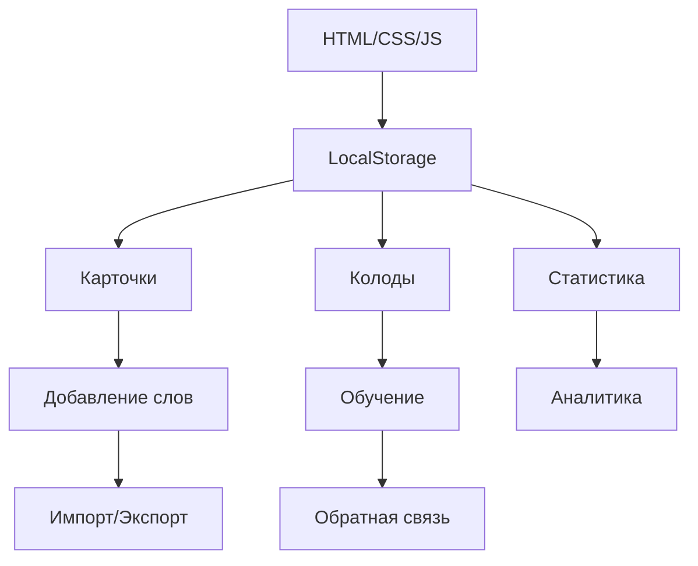
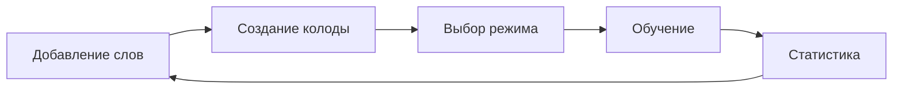

```markdown
# Japanese Vocabulary Trainer  🇯🇵

> Простое и эффективное веб-приложение для изучения японской лексики, работающее полностью в браузере


## ✨ Основные возможности

###  📚 Управление словарным запасом
- ✅ **Добавление слов** вручную через интуитивную форму
- ✅ **Импорт из файлов** (.txt/.csv) поддержкой drag-and-drop
- ✅ **Автоматическое создание** карточек (минимум 10 слов)
- ✅ **Просмотр и удаление** карточек с подтверждением
- ✅ **Экспорт в CSV** для резервного копирования

###  🎓 Режимы обучения (4 типа)
| Режим | Описание | Сложность |
|-------|----------|-----------|
| **Ввод на японском** | Напишите слово по переводу |  ⭐⭐⭐ |
| **Ввод перевода** | Напишите перевод по японскому | ⭐⭐⭐ |
| **Выбор перевода** | Выберите правильный перевод из вариантов |  ⭐⭐ |
| **Выбор написания** | Выберите правильное написание из вариантов |  ⭐⭐ |

### 📊 Статистика и прогресс
- 📈 **Общее количество** карточек
-  📅 **Ежедневный счетчик** изученных слов
- 📈 **Прогресс по карточкам** (правильные/неправильные ответы)
- 🔥 **Серии правильных ответов** (streaks)
-  ❌ **Количество ошибок** и точность

##  🏗️ Архитектура



**Технический стек:**
- 📦 **Хранение данных**: LocalStorage браузера
-  🎨 **Дизайн**: Адаптивный + Тёмная тема (системные настройки)
-  ⚡ **Производительность**: Нулевые зависимости, чистый JS
- 📱 **Кросс-платформенность**: Mobile-first подход

##  🚀 Быстрый старт

### 1. Запуск
```bash
# Просто откройте index.html в браузере
# Не требует установки Node.js или сервера!
open index.html
```

### 2. Формат импорта
```csv
японское_слово,русский_перевод
ねこ,кошка
いぬ,собака
こんにちは,здравствуйте
```

### 3. Рабочий процесс


##  📱 Интерфейс

### Десктоп
-  📌 **Вкладки** для быстрой навигации
-  🖱️ **Hover-эффекты** и плавные переходы
-  📊 **Информационные карточки** со статистикой

### Мобильные устройства
- 📲 **Нижняя панель** навигации
-  👆 **Swipe-взаимодействия**
-  ✨ **Адаптивная сетка**

### Визуальная обратная связь
- ✅ **Подсветка правильных ответов** (зелёная)
- ❌ **Подсветка ошибок** (красная)
- ✨ **Анимации** при переходах

##  ⚠️ Важные примечания

> **Данные хранятся локально!** При очистке кэша браузера все данные будут удалены. Рекомендуется регулярно экспортировать прогресс через CSV.

## 🛠️ Рекомендации по использованию

1. **Начните с малого**: Добавьте 10-15 слов
2. **Выберите удобный режим**: Новичкам рекомендуем "Выбор перевода"
3. **Следите за статистикой**: Цель - 80%+ правильных ответов
4. **Регулярность**: Ежедневные 10-15 минут эффективнее час раз в неделю

---

**Создано с  ❤️ для эффективного изучения японского языка**
```
